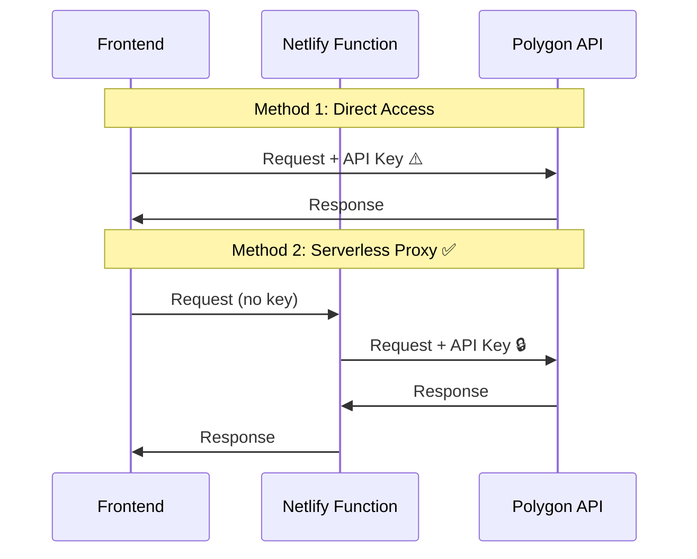
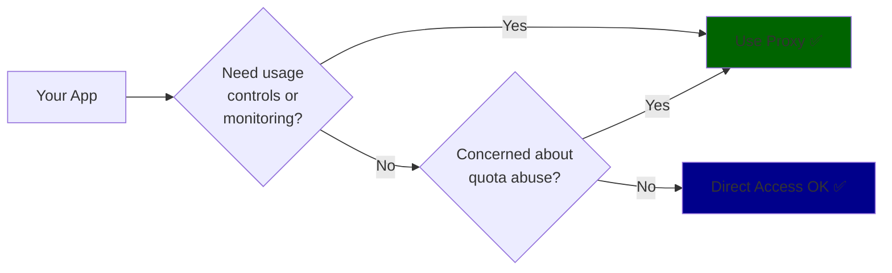

# API Key Management: Direct vs Proxy

## Architecture Comparison

## Quick Comparison

| Aspect            | Direct Access        | Serverless Proxy       |
| ----------------- | -------------------- | ---------------------- |
| **Security**      | ⚠️ API key exposed   | ✅ Key protected       |
| **Latency**       | ✅ ~100ms            | ⚠️ ~200ms (+100ms)     |
| **Setup Time**    | ✅ 5 minutes         | ⚠️ 30 minutes          |
| **Rate Limiting** | ❌ None              | ✅ Can add controls    |
| **Key Rotation**  | ❌ Requires redeploy | ✅ Change env var only |
| **Maintenance**   | ✅ Simpler           | ⚠️ Extra code          |

## Decision

### **Recommendation: Depends on Your Needs**

#### Use **Serverless Proxy** if:

- ✅ You want to follow best practices
- ✅ You may add rate limiting later
- ✅ You want easy key rotation
- ✅ You want usage monitoring
- ✅ You're concerned about quota abuse

#### Use **Direct Access** if:

- ✅ It's a free tier API (no cost risk)
- ✅ No sensitive data exposed
- ✅ You want simplicity
- ✅ 100ms latency matters
- ✅ You're okay with potential quota exhaustion

---

**Context:** Since Polygon API free tier has no cost risk and doesn't expose sensitive data, direct access is **acceptable** for this use case. However, the proxy approach is still considered **better practice** and makes future enhancements easier.
