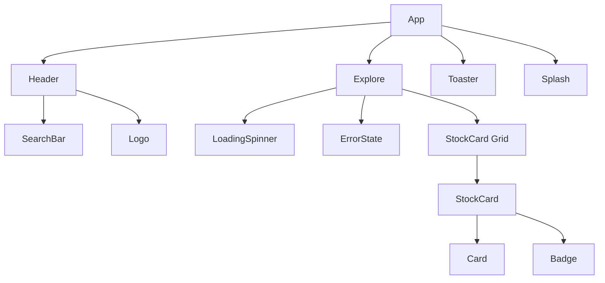

# Stock Explorer - Component Architecture

## Component Architecture

## Component Descriptions

### Core Components

- **App**: Root component managing application state and routing between Splash and main app
- **Header**: Navigation header containing logo and search functionality
- **Explore**: Main page component for displaying stock listings with infinite scroll
- **SearchBar**: Input component with debounced search functionality
- **StockCard**: Individual stock display component with company info and ticker badge

### UI Components

- **LoadingSpinner**: Loading indicator for async operations
- **ErrorState**: Error display component with retry functionality
- **Toaster**: Toast notification system for user feedback
- **Splash**: Initial loading screen component
